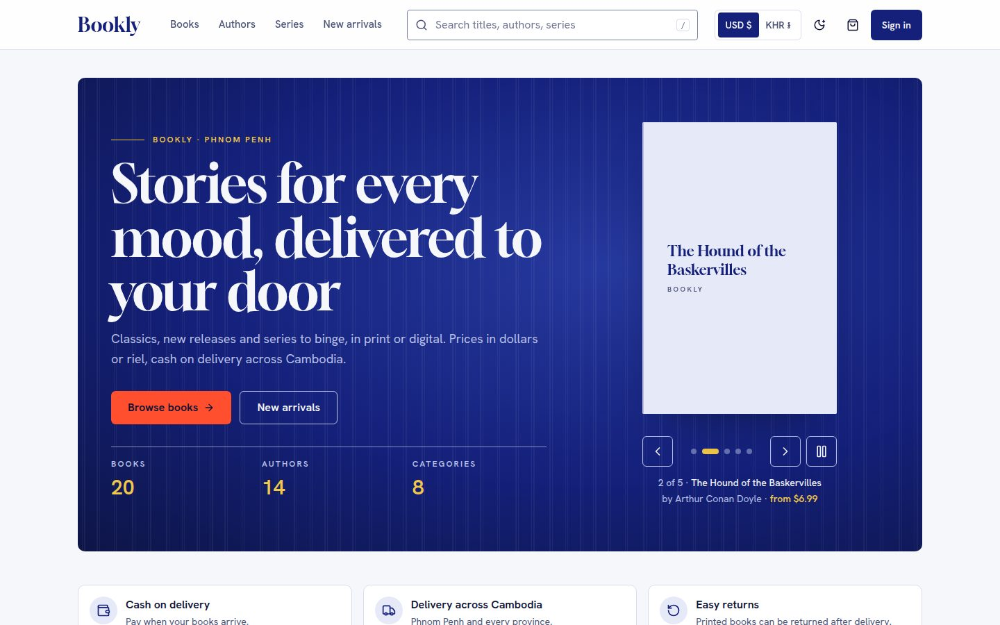
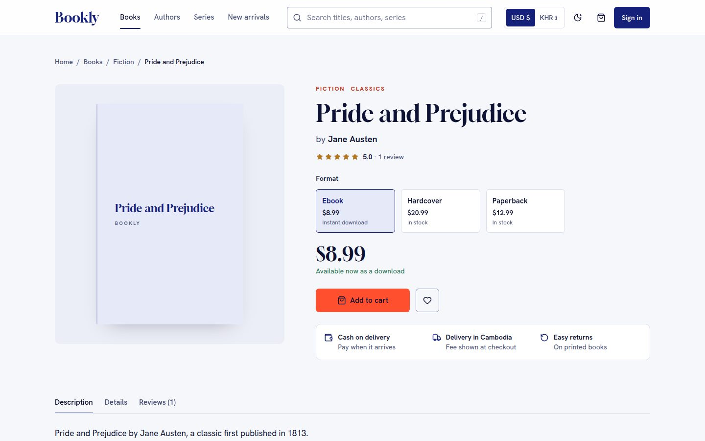
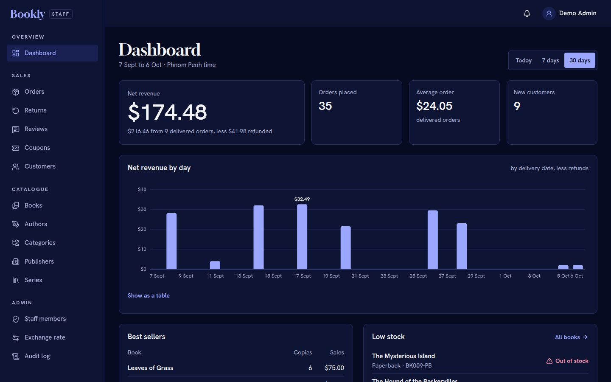

# Bookly — Frontend

An online bookshop for Cambodia: a customer storefront and a staff admin, built with **React 19**, **TypeScript**, **Vite** and **Tailwind CSS 4** on top of the [Bookly API v2](https://github.com/danishsary8/bookly_backend_v2) (Laravel).




| Book page | Admin dashboard (dark) | Phone (dark) |
| --- | --- | --- |
|  |  |  |

## Features

**Storefront**
- Catalogue with filters (category, format, language, price), live search, authors, series, publishers.
- Book pages with formats (paperback, hardcover, ebook, audiobook), stock, reviews and ratings.
- Prices in US dollars or Cambodian riel (the rate is set by the shop).
- Cart, coupons and checkout with **cash on delivery** (card and KHQR are shown as "coming soon").
- Account: profile, password, address book, wishlist, orders with a timeline, cancelling, returns, reviews.
- Sign up with email verification, password reset with a 6-digit code.
- Shipping, returns, FAQ, about, contact, privacy and terms pages; offline banner; light and dark themes.

**Admin** (`/admin`, staff only, two-step verification required)
- Dashboard: net revenue, orders, average order, new customers, daily sales chart, best sellers, low stock.
- Books with formats, prices and stock; authors, categories, publishers, series.
- Orders (status changes with notes, CSV export), returns (approve, reject, refund), reviews (hide / show), coupons, customers.
- Admins only: staff members (invite, roles, deactivate, reset two-step verification), exchange rate, audit log.

## Tech stack

| Area | Choice |
| --- | --- |
| UI | React 19, TypeScript, Tailwind CSS 4, Radix primitives, Lucide icons |
| Data | TanStack Query 5, axios, types generated from the API's OpenAPI spec |
| Forms | React Hook Form + Zod |
| Motion | Motion (`LazyMotion`, features loaded after first paint), reduced-motion aware |
| Tests | Vitest + Testing Library (unit), Playwright + axe (smoke and accessibility) |
| Design | `design-system/bookly/MASTER.md` (tokens, type, spacing, components) |

## Getting started

Requirements: Node 22, and the API running locally or the live API.

```bash
npm install
cp .env.example .env      # then set VITE_API_BASE_URL
npm run dev               # http://localhost:5173
```

| Variable | What it's for |
| --- | --- |
| `VITE_API_BASE_URL` | The API, including `/api/v1`. Local: `http://localhost:8000/api/v1` (`php artisan serve` in the backend, with `DemoSeeder` data). Live: `https://bookly-api-zasc.onrender.com/api/v1` (free plan: the first request after a quiet spell takes 30–60 s). |
| `VITE_SITE_URL` | The site's public address, used at build time for `sitemap.xml`, `robots.txt` and share links. Leave empty locally. |
| `VITE_TURNSTILE_SITE_KEY` | Cloudflare Turnstile site key: a bot check on sign-up, sign-in and the forms that email a code. Off when empty; the API needs `TURNSTILE_SECRET_KEY` at the same time. |
| `VITE_GOOGLE_CLIENT_ID`, `VITE_FACEBOOK_APP_ID` | Turn on "Continue with Google / Facebook". Each provider shows once its id is set; the API needs the matching keys. |

The API only accepts requests from the origins in its `CORS_ALLOWED_ORIGINS` (by default `http://localhost:5173`).

## Scripts

| Command | Does |
| --- | --- |
| `npm run dev` | Development server |
| `npm run build` | Typecheck and production build (`dist/`), plus `robots.txt` and `sitemap.xml` |
| `npm run preview` | Serve the production build |
| `npm run lint` / `npm run typecheck` | ESLint / TypeScript |
| `npm test` | Unit tests (Vitest) |
| `npm run e2e` | Smoke and accessibility tests (Playwright), see below |
| `npm run api:types` | Regenerate API types from the backend's OpenAPI spec |

## Testing

`npm test` runs the unit tests; CI runs lint, typecheck, unit tests and the build on every push.

`npm run e2e` drives a real browser against a running app and API (local API with demo data, Vite on :5173):

- `e2e/a11y.spec.ts`: axe WCAG 2.1 A/AA checks on the public pages, light and dark, desktop and phone.
- `e2e/smoke.spec.ts`: keyboard basics (skip link, drawer focus), a customer order from book page to cash-on-delivery confirmation, and a staff member signing in with an authenticator code and moving that order on.

| Variable | Default |
| --- | --- |
| `E2E_BASE_URL` | `http://localhost:5173` |
| `E2E_API_URL` | `http://localhost:8000/api/v1` |
| `E2E_CUSTOMER_EMAIL` / `E2E_CUSTOMER_PASSWORD` | the demo customer |
| `E2E_STAFF_EMAIL` / `E2E_STAFF_PASSWORD` / `E2E_STAFF_TOTP_SECRET` | the staff test is skipped without a password and the authenticator secret |
| `PW_CHROMIUM` | path to an existing Chromium (otherwise run `npx playwright install chromium`) |

## Project structure

```
src/
  api/          API client, session, endpoints, generated types, query keys
  components/   UI kit (ui/), site shell, catalogue, forms, motion
  features/     Feature logic: auth, cart, checkout, orders, account, admin, content
  pages/        Route pages (storefront, account, checkout, content, admin)
  routes/       Routes and guards
  stores/       Small stores: currency, toasts, shell panels, recently viewed
  content/      Shop facts and page copy (shipping, returns, contact)
e2e/            Playwright tests
scripts/        Build helpers (API types, SEO files)
docs/           Plan, worklog, next step, screenshots
design-system/  Design rules (MASTER.md and page overrides)
```

## Deploying

Any static host works; the app is a single-page app, so every path must serve `index.html` (`vercel.json` does this on Vercel). Set `VITE_API_BASE_URL` and `VITE_SITE_URL` in the host's build settings, and add the site's address to the API's `CORS_ALLOWED_ORIGINS`.

## Author

Built by [danishsary8](https://github.com/danishsary8).
